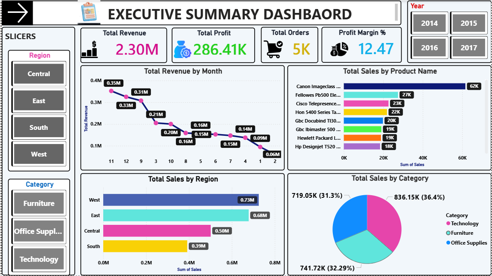
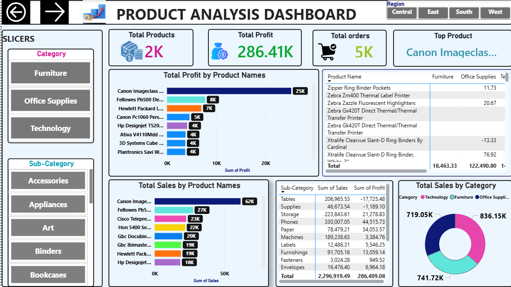
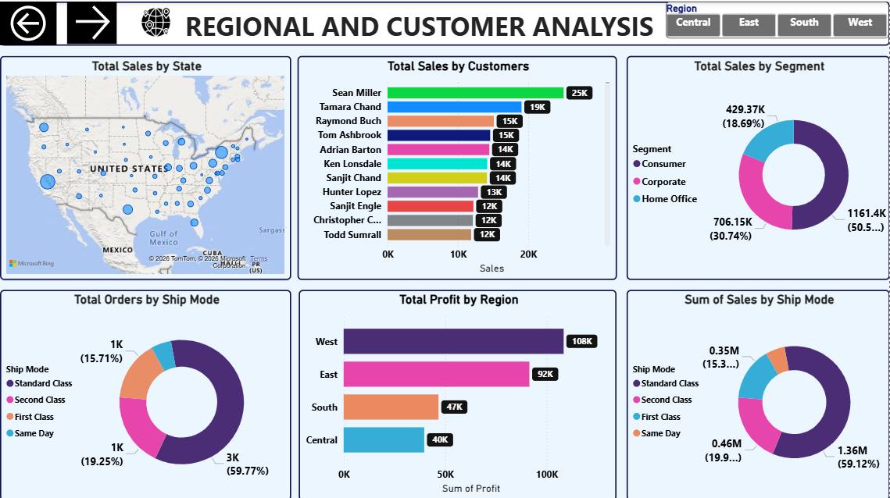
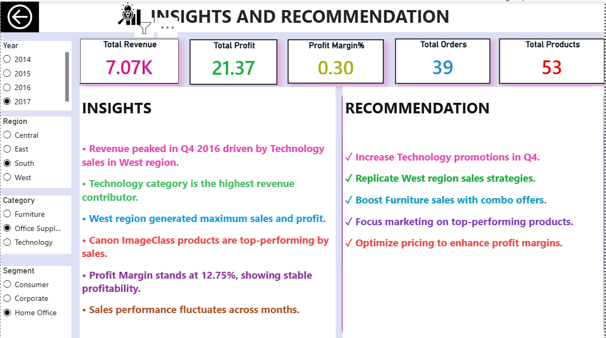

# 📊 Sales Analytics Dashboard

An interactive Business Intelligence dashboard built using Power BI to analyze sales performance, profitability, customer behavior, and regional trends.  

This project demonstrates end-to-end Data Analytics workflow including:
- Data Cleaning
- Data Modeling
- DAX Calculations
- Business KPI Analysis
- Interactive Dashboard Design
- Business Recommendations

---

# 🚀 Project Overview

The goal of this project is to help businesses:
- Track sales performance
- Monitor profitability
- Identify top-performing products
- Analyze customer segments
- Discover regional trends
- Make data-driven business decisions

---

# 🛠 Tools & Technologies Used

| Tool | Purpose |
|------|----------|
| Power BI | Dashboard Development |
| Excel | Data Cleaning |
| SQL | Data Analysis Queries |
| DAX | KPI Calculations |
| Power Query | Data Transformation |

---

# 📂 Dataset Information

Dataset Used:
- Superstore Sales Dataset

Dataset Includes:
- Orders
- Sales
- Profit
- Customers
- Products
- Regions
- Discounts
- Shipping Information

---

# 📌 Business Problems Solved

This dashboard answers important business questions such as:

- Which products generate maximum revenue?
- Which region performs best?
- Which customer segment is most profitable?
- How do discounts affect profit?
- What are the monthly sales trends?
- Which categories require improvement?

---

# 📈 Dashboard Features

## Executive Dashboard
- Total Sales KPI
- Total Profit KPI
- Profit Margin
- Monthly Sales Trend
- Sales by Region
- Top Categories

---

## Product Analysis Dashboard
- Best Selling Products
- Sub-Category Analysis
- Profit by Product
- Discount Impact
- Product Performance Ranking

---

## Regional & Customer Dashboard
- Sales by State
- Customer Segment Analysis
- Shipping Analysis
- Top Customers
- Regional Profitability

---

# 📊 Key KPIs

| KPI |         | Description |

| Total Sales   | Overall Revenue Generated |
| Total Profit  | Net Profit Earned |
| Profit Margin | Profitability Percentage |
| Total Orders  | Number of Orders |
| Average Order Value| Average Order |
| YoY Growth    | Year-over-Year Growth |

---

# 🧠 Business Insights

### 🔹 Sales Performance
- Technology category generated the highest revenue.
- Office Supplies category had high sales but lower profit margin.
- Sales increased significantly during year-end months.

### 🔹 Profitability Analysis
- Higher discounts negatively impacted profitability.
- Some products generated high sales but very low profit.
- West region contributed the highest overall profit.

### 🔹 Customer Insights
- Consumer segment generated maximum orders.
- Corporate customers had higher average order values.
- Repeat customers contributed major revenue share.

### 🔹 Regional Insights
- California and New York were top-performing states.
- Some regions showed strong sales but weak profitability.
- Shipping costs affected profits in low-volume regions.

---

# 💡 Business Recommendations

- Reduce excessive discounting on low-margin products.
- Focus marketing efforts on profitable customer segments.
- Improve inventory planning for top-selling products.
- Optimize shipping strategy for low-profit regions.
- Increase promotion of high-margin products.

---

# 🖼 Dashboard Preview

## Executive Dashboard


---

## Product Analysis Dashboard


---

## Regional & Customer Dashboard


---

## Regional & Customer Dashboard


---

# 🧮 DAX Measures Used 

```DAX
Total Sales = SUM(Orders[Sales])

Total Profit = SUM(Orders[Profit])

Profit Margin = 
DIVIDE([Total Profit],[Total Sales],0)

Average Order Value =
DIVIDE([Total Sales],[Total Orders],0)
```

---

# 🗂 Project Structure

```text
Sales-Dashboard-Project/
│
├── Dashboard
│   └── Sales_Dashboard.pbix
│
├── Dataset
│   └── Superstore_Data.xlsx
│
├── Images
│   ├── executive-summary-dashboard.png
│   ├── product-analysis.png
│   └── regional-dashboard.png
│   └── insights-recommendation-dashboard.png
└── README.md
```

---

# 📥 How to Use

1. Download the repository
2. Open `.pbix` file in Power BI Desktop
3. Refresh dataset if required
4. Explore dashboard filters and visuals

---

# 🎯 Skills Demonstrated

- Data Cleaning
- ETL Process
- Data Visualization
- Dashboard Design
- KPI Development
- Business Analysis
- SQL Query Writing
- DAX Calculations
- Insight Generation

---

# 📌 Future Improvements

- Add Forecasting Models
- Add Customer Churn Analysis
- Deploy Dashboard to Power BI Service
- Automate Data Refresh
- Add Advanced Drillthrough Pages

---

# 🤝 Connect With Me

## LinkedIn
[My Linkedin Profile Link]([https://www.linkedin.com/in/sanju1234])

## GitHub
[My GitHub Profile Link]([https://github.com/SanjuVerma123])

---

# ⭐ If You Like This Project

Please consider giving this repository a ⭐ on GitHub.

---

# 📜 License

This project is for educational and portfolio purposes.
